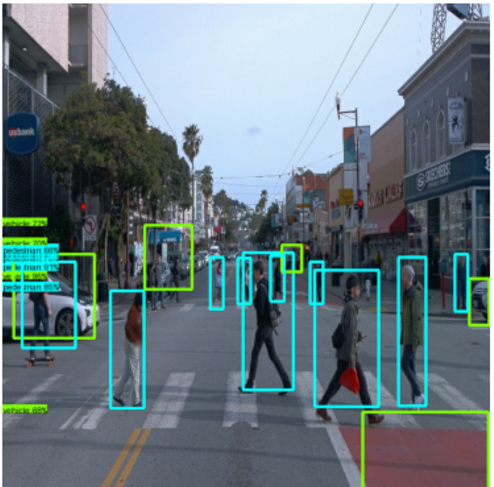
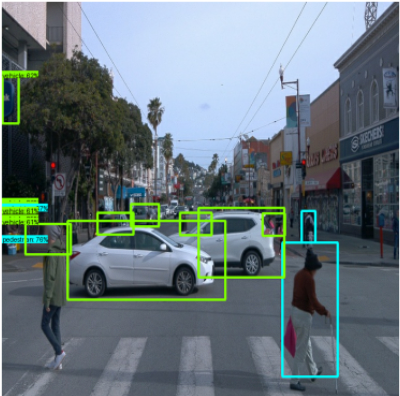
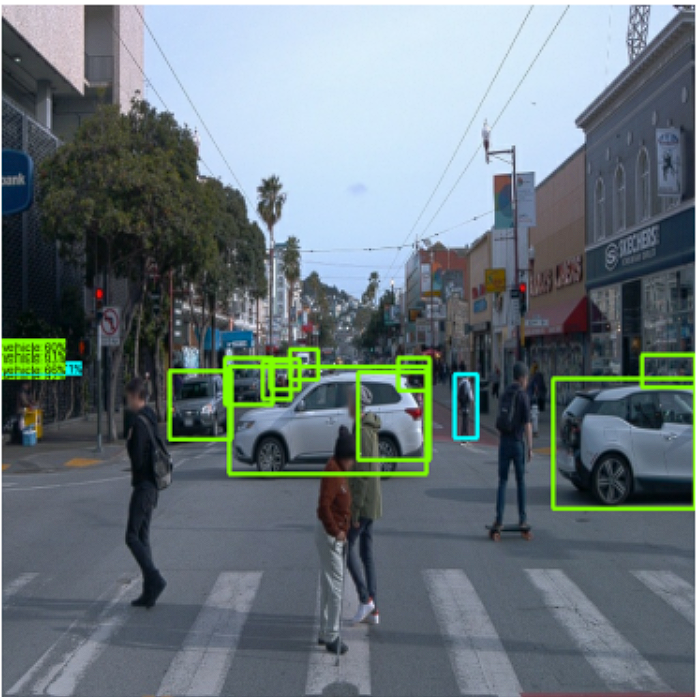

# Object-Detection-in-an-Urban-Environment

## Table of Contents
1. [Introduction](#introduction)
2. [Dataset](#dataset)
3. [Methodology](#methodology)
4. [Training & Deployment Process with AWS](#training--deployment-process-with-aws)
5. [Model Selection](#model-selection)
6. [Results](#results)
7. [Future Work & Possible Improvement](#future-work--possible-improvement)

## Introduction
This project focuses on utilizing transfer learning using the TensorFlow Object Detection API and AWS Sagemaker to train models for detecting and classifying objects in an urban environment. The data used is sourced from the Waymo Open Dataset, providing a robust basis for training.

## Dataset
The dataset consists of front camera images from the Waymo Open Dataset. These data are stored in TFRecord format, which is a simple format for storing a sequence of binary records. The TFRecord format is used to enhance data reading and processing efficiency.

## Methodology
This project uses AWS services to manage the training and deployment process:
- **AWS Sagemaker**: For running Jupyter notebooks, training the model, deploying it, and performing inference.
- **AWS Elastic Container Registry (ECR)**: To build the Docker image and create the container required for running this project.
- **AWS Simple Storage Service (S3)**: Used to save logs for creating visualizations and store the data in a public S3 bucket.

## Training & Deployment Process with AWS
The model training and deployment processes were conducted using AWS services. AWS Sagemaker was utilized to run Jupyter notebooks, facilitating the training, deployment, and inference processes. Docker images were built and containers created using AWS Elastic Container Registry (ECR), while logs were saved to AWS Simple Storage Service (S3) for visualization purposes.

## Model Selection
In this project, several object detection models from the TensorFlow 2 Object Detection Model Zoo were tested:

| Model                 | Config File        |
|-----------------------|--------------------|
| Model_1_SSD_EfficientNet    | [File](Model_1_SSD_EfficientNet\1_model_training\source_dir\Model_EfficientNet_pipeline.config) |
| Model_2_FasterRCNN   | [File](Model_2_FasterRCNN\1_model_training\source_dir\Model_ResNet.config) |
| Model_3_MobileNet | [File](Model_3_MobileNet\1_model_training\source_dir\Model_MobileNet_pipeline.config) |

These pre-trained models, trained on the COCO 2017 dataset, were selected for testing. Modifications were made to the `pipeline.config` files to ensure compatibility with the Waymo Open Dataset, which has 3 classes: Cars, Pedestrians, and Cyclists, as opposed to the 90 classes in the COCO dataset.

For consistency and due to budget constraints, the training steps were limited to 2000 for all models. The same batch size of 8 and Momentum Optimizer were used across the experiments.

**Summary of Experiments and Best Model Selection**
**Note:** Due to limited AWS credits, I conducted the evaluation based on visual inspection and manual analysis rather than using TensorFlow Board for in-depth metrics.
 
## Results

In this project, I evaluated three object detection models: **Model_1_SSD_EfficientNet**, **Model_2_FasterRCNN**, and **Model_3_MobileNet**. After analyzing their performance, I chose **Model_1_SSD_EfficientNet** as the best model for deployment in an urban environment.

### Model Performance (Recognition Accuracy)
- **Model_1_SSD_EfficientNet:** 76%-91% Recognition Accuracy
- **Model_2_FasterRCNN:** 68%-76% Recognition Accuracy
- **Model_3_MobileNet:** 61%-68% Recognition Accuracy

### Model Performance Visualizations
- **Model_1_SSD_EfficientNet:**  
  

- **Model_2_FasterRCNN:**  
  

- **Model_3_MobileNet:**  
  

## Validation Loss vs. Training Loss

For **Model_1_SSD_EfficientNet**, there was a slight difference between the validation loss and the training loss, indicating mild overfitting.

- **Training Loss:** 0.24
- **Validation Loss:** 0.28

This difference is expected due to the complexity of the urban environment dataset. While the model has learned the training data well, it still faces challenges in generalizing to unseen data, as evidenced by the higher validation loss.

## Expected Behavior of Losses/Metrics

The behavior of the losses and metrics was as anticipated. **Model_1_SSD_EfficientNet** with its EfficientNet backbone provided a good balance between speed and accuracy, which is crucial for real-time object detection in urban environments. The slight overfitting was expected due to the model's complexity and the dataset's variability.

## Suggestions for Improvement

To further enhance the performance of **Model_1_SSD_EfficientNet**, the following strategies can be considered:

1. **Data Augmentation:** Apply more aggressive data augmentation techniques to improve the model's generalization across different scenarios.
2. **Regularization Techniques:** Implement stronger regularization methods, such as Dropout or L2 regularization, to reduce overfitting.
3. **Fine-Tuning Hyperparameters:** Experiment with different learning rates, batch sizes, and optimization algorithms to optimize performance for this specific dataset.
4. **Transfer Learning with More Complex Models:** Consider exploring more complex models or ensembles of models, depending on the available computational resources, to achieve better accuracy.

**Model_1_SSD_EfficientNet** provides a solid foundation with a good balance between accuracy and efficiency, making it the optimal choice for deployment in this urban environment object detection task.